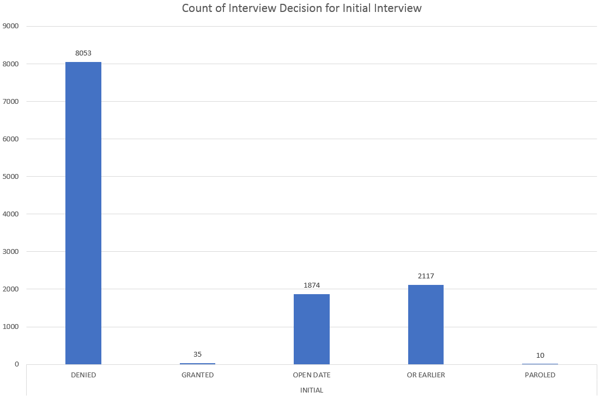
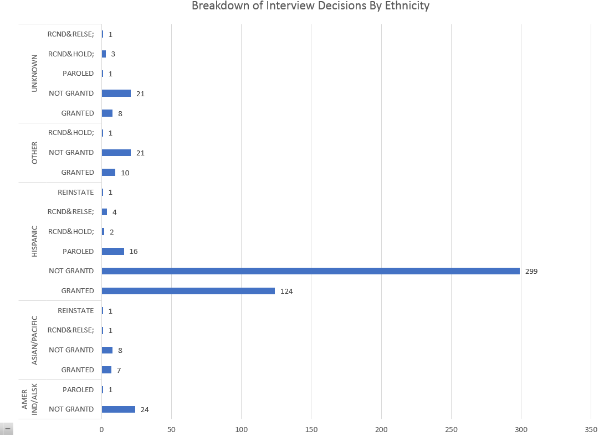
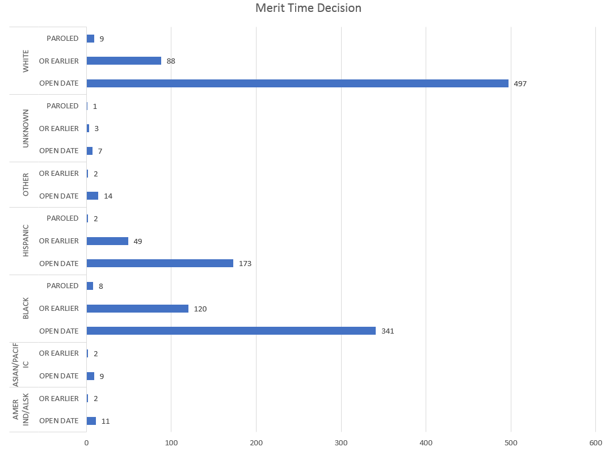
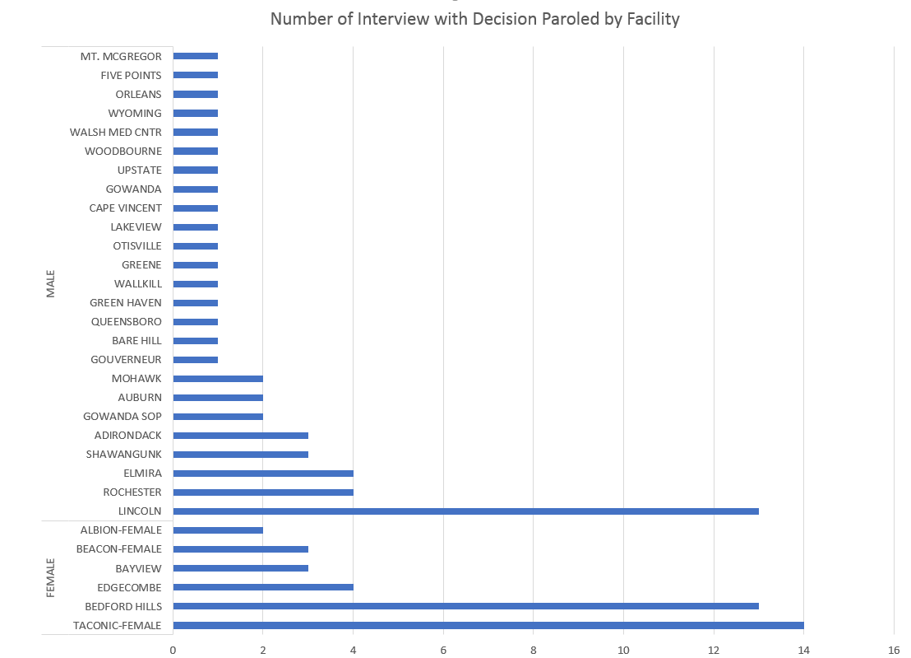

**Eric Diep, CS 725 - Homework 6**

# Introduction

In New York State, when offenders are eligible for parole, they appear in front of the Parole Board. More often than not, they are denied parole with little reason. To understand the how the board operates, we will be exploring the parole dataset. The dataset contains over 30,000 records from the Parole Board's website. Our goal is to explore the dataset to identify trends, outliers, correlations, and the like. With this we will be able to present useful informaiton about how the board operates.

# Findings
1. The last 2 columns, 'Parole Board Interview Type' and 'Interview Decision', grabbed my attention. The 'Parole Board Interview Type' column indicates the type of interview when the offender appears before the Parole Board. There are a variety of hearing types. The 'Interview Decision' column indicates the Board's decision on the offender's release after his or her interview. Seeing that all offenders will have an initial appearance before the Parole Board, there was curiosity about if there is a rountine decision made. The chart below presents the count of the Board's decision for an offender's initial interview. There are 8,053 recorded occurrences where the Board's decision after an initial interview is 'DENIED' - denying the offender eligibility for release. Also interesting to mention, there are 2,117 recorded occurrences where the decision is 'OR EARLIER' - meaning the interview is postponed. This finding meant that it was not uncommon for an offender to appear before the Parole Board more than once. Suprisingly, there were 10 initial interviews where it ended with a 'PAROLED' decision - meaning the offender is eligible for parole by a determined date.

2. In the chart above, it was surprising to see the initial interview decision 'OPEN DATE' having 1,874 recorded occurrences. 'OPEN DATE' means the offender is eligible for parole at the earliest date. I was curious to see the breakdown of offenders by gender and ethnicity where their interview received an 'OPEN DATE' decision. The chart below presents the number offenders where their initial interview received the decision 'OPEN DATE'. As presented in the chart below, offenders that are of black or white ethnicity lead in both male and female category for receiving 'OPEN DATE' decision after an initial interivew. Seeing other ethnicities trail behind, an assumption would be that there are not many offenders of other ethncities either in prison or eligible for parole. From this breakdown, I wondered, what interview decision is common for each ethinic group from all interview types.

3. Seeing that offenders of black and white ethnicity in both male and female category leading in initial interview with 'OPEN DATE' decision, I posed the question, what is the common interview outcome (excluding denied, postponement, and open date) for each ethnicity (excluding black, and white) for all interview types (excluding initial interview)? The chart below presents the breakdown of interview decisions for each ethnicity with the aforementioned criterias. As seen in the chart, the most common interview outcome for other all other ethnicities, aside from black, and white, is 'NOT GRANTED'. This decision means that the offender where they are interviewing for merit time or Conditional Parole for Deportation Only (CPDO) is not granted. Also interesting to mention is that offenders of Hispanic ethncitiy leads in the interview decision 'GRANTED'. This decision means the offender is granted parole on the condition they are deported. Since the decision 'NOT GRANTED' is common across all ethnicities and used during merit time interview, I was curious about the breakdown of offenders whom are awarded merit time.

4. Merit time means the offender is under consideration for early release as long as they exhibit good behavior, and satifies determined criterias. I posed the question, looking at all offenders for all ethnicity, when their interview type is 'MERIT TYPE', what is the usual outcome? In the chart below, we see that the most common decision for offenders on merit time is 'OPEN DATE'. This means the offender will be on parole at the earliest date. Again, we see that offenders of black or white ethnicity is far in front. With this, the assumption that many offenders of other ethnicities are not in prison or they are not eligible for merit time. Also interesting to note, there are a few instances where the offender interviewing for parole is granted parole. Seeing this breakdown of offenders eligible for merit time, made me curios about the breakdown of facilites that housed the offenders eligible for merit time or where the interview is held.

5. Seeing that it is possible to be granted parole, either earliest possible date or an expected date, when an offender is granted merit time. I posed the question, what is the number of merit time interviews that eneded with decision 'PAROLED'? This decision means that the offenders parole date is straight forward. From the chart below, we can see there are 2 female facilities, Taconic-Female, and Bedfore Hills, had the most offenders granted parole. There is 1 male facility that has the most male offenders granted parole. Also interesting to know, there were 24 out of 59 male facilites had interviews where decision is paroled; 6 out of 8 female facilities had interviews where decision is paroled.

# Conclusion
After my analysis, I found that it is not uncommon for an offender to appear before the Parole Board more than once. There are possibilites where the offender may be only appear before the Board once, but that is rare. I also noticed that the make up of offenders appearing before the Parole Board is of black or white ethnicity. I am curious if this is because there are less offenders of other ethnicity in prison, or if they are not eligible for parole. An intesting point to bring up is that there are 2 female facilites, and 1 male facility with the most offenders on parole. An assumption would be these facilities have good parole programs.

# References
 - [New York State's Department of Corrections and Community Supervision Offender Information Data Defintions](http://www.doccs.ny.gov/calendardatadefinitions.html)
 - [Parole Dataset](http://www.cs.odu.edu/~mweigle/CS725-S18/HW6)
 - [New York State's Parole Handbook](http://www.doccs.ny.gov/Parole_Handbook.html)