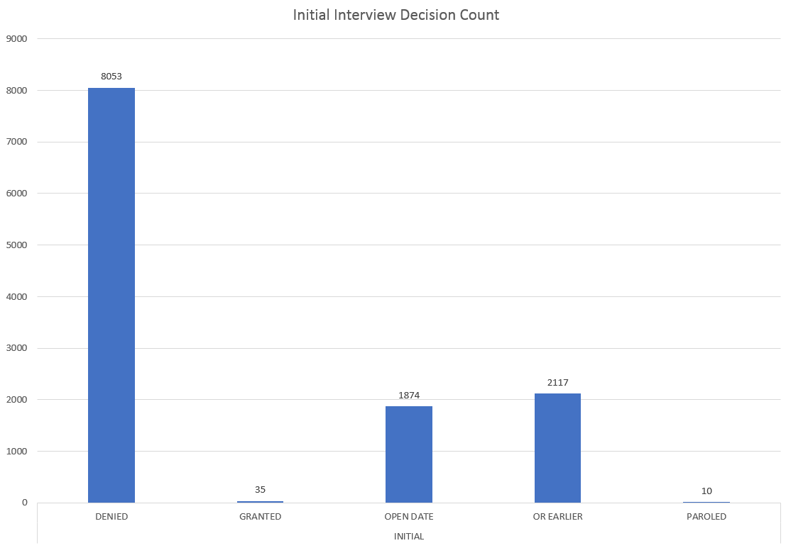
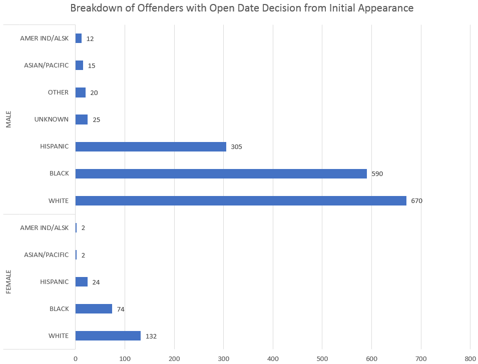

**Eric Diep, CS 725 - Homework 6**

**Initial Findings**
 - ~~In Bayview facility,~~ When interview type is 'Merit Time', interview decision was usually 'Open Date'.
 - ~~In Bayview facility,~~ For initial interview, decision is either denied or postponment for the majority of the time. **Start with this**
 - Surprising amount of inital appearance has denied decision, 8053; there are 2117 records where decision is OR EARLIER for initial appearance.
    - This means it is not uncommon for an inmate to reappear before the board multiple times. 
 - Majority of the time, if interview type is either ECPDO or DEPORT, decicision is usually granted.
    - One case where interview type is PIE, and decision was granted. Granted meant CPDO granted.
    - 124 records where ethnicity is Hispanic the decision is granted **Really want this share this information**
 - Overwhelmingly, if interview type is PIE, decision usually denied or postponement.
 - 2 female facility (Taconic-female, and bedford hills) had more inmates on parole. 1 male facility, Lincoln, had the most inmates on parole. **Want to share this**
 - Surprising amount of inmates with interview type PV REAPP has decision paroled. **This was interesting**
 - Even for reappearance type, there are 4471 denied decision.
 - For inmates that meets criteria for MERIT TIME, they are generally not granted.
 - **Does merit time lead to either paroled or open date?**
 - Even if an inmate is eligible for parole immediately, their hearing decision is either deined or postponed
 - 24 out of 59 male facilites had interviews where decision is paroled; 54 out of 59 male facilities had interviews where decision is open date **Want to share this**
 - 6 out of 8 female facilities had interviews where decision is paroled; 8 out of 8 female facilities had interviews where decision is open date **Want to share this**

# Introduction

In New York State, when prisoners are eligible for parole, they appear in fron of the Parole Board. More often than not, they are denied parole with little reason. To understand the how the board operates, we will be exploring the parole dataset. The dataset contains over 30,000 records from the Parole Board's website. Our goal is to explore the dataset to identify trends, outliers, correlations, and the like. With this we will be able to present useful informaiton in how the board operates.

# Findings
1. When first looked at dataset, the last 2 columns, parole board interview type and interview decision, caught attention. Parole board interview type column indicates the type of appearance by the offender before the Parole Board. There are a variety of hearing types. Interview decision column indicates the Board's decision on the offender's release after his/her interview. There was curiosity as to what is normally the decisions when the interview type is initial. Below chart presents the count of the board's decision for an offender's initial interview. There are 8,053 recorded times where the board's decision after an initial interview is denied. Followed by 2,117 recorded times where the decision is "OR EARLIER" - this means the interview is postponed. This finding meant that it was not uncommon for an offender to appear before the Parole Board more than once. Suprisingly, there were 10 initial interviews where it ended with a 'PAROLED' decision.

2. In the chart above, it was surprising to see the interview decision "OPEN DATE" having 1,874 recorded occurrences. "OPEN DATE" means the offender will be on parole at the earliest date. I was curious at the breakdown of the offenders where their initial interview received an "OPEN DATE" decision. The chart below presents the number of initial interviews where they ended with the Board's decision of 'OPEN DATE'. The breakdown is by gender and ethnicity. As shown, black and white enthnicities lead in both male and female category. This made me wonder what interview decision is common for each ethinic group.

3. what is the common interview outcome (excluding denied, postponement) for each ethnicity (besides black and white)?
4. what is the average number of interviews per ethnic group?

5. In the first chart there were records of interviews that ended with the decision of 'PAROLED'. I was curious about the number of interviews which ended with 'PAROLED' decision by gender and facility. Besides an interview decision of 'OPEN DATE', an interview can lead to a decision of 'PAROLED'. This decision means that the offenders parole date is straight forward. 24 out of 59 male facilites had interviews where decision is paroled; 6 out of 8 female facilities had interviews where decision is paroled. 2 female facility (Taconic-female, and bedford hills) had more female offenders on parole. 1 male facility, Lincoln, had the most male offenders on parole.

7. 54 out of 59 male facilities had interviews where decision is open date; 8 out of 8 female facilities had interviews where decision is open date

# Conclusion

# References
 - [New York State's Department of Corrections and Community Supervision Offender Information Data Defintions](http://www.doccs.ny.gov/calendardatadefinitions.html)
 - [Parole Dataset](http://www.cs.odu.edu/~mweigle/CS725-S18/HW6)
 - [New York State's Parole Handbook](http://www.doccs.ny.gov/Parole_Handbook.html#h2_25)