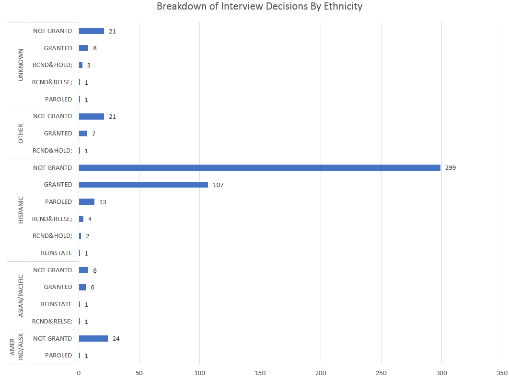

**Eric Diep, CS 725 - Homework 6**

# Introduction

In New York State, when offenders are eligible for parole, they appear in front of the Parole Board. More often than not, they are denied parole with little to no reason. A dataset was built containing information about the offender, their parole hearing, and the decision. The goal is to explore the dataset to be able to identify trends, features, correlations, and the like from the dataset. In the end, I hope to be able to have a better understanding of how the Parole Board functions.

# Findings
1. The last 2 columns, "Parole Board Interview Type" and "Interview Decision", in the dataset initially grabbed my attention. The "Parole Board Interview Type" column indicates the type of interview when the offender stands before the Parole Board. The "Interview Decision" column indicates the Board's decision after the interview. Seeing that all offenders will have an initial interview, I was curious to know if there is a predicitable outcome. The chart below presents the count of the Board's decision for an offender's initial interview. There are 8,053 recorded occurrences where the Board's decision after an initial interview is 'DENIED' - denying the offender's eligilibity to be on parole. Also interesting to mention, there are 2,117 recorded occurrences where the decision is 'OR EARLIER' - the interview is postponed. This finding meant that it was not uncommon for an offender to appear before the Parole Board more than once. Suprisingly, there were 10 initial interviews where the decision is 'PAROLED' - the offender is granted parole by a certain date. Besides those 10 interviews ending with decision 'PAROLED', there are 1,874 occurrences of initial interview ending with 'OPEN DATE'. I was curious to know what this decision entailed.

2. In the chart above, it was surprising to see the initial interview decision 'OPEN DATE' having 1,874 recorded occurrences. The decision 'OPEN DATE' is defined as the offender is eligible for parole at the earliest date as long as their release plan is approved. I was curious to see the breakdown of offenders by gender and ethnicity where their initial interview received the decision 'OPEN DATE'. The chart below presents the number offenders where their initial interview received the decision 'OPEN DATE'. As presented in the chart below, offenders of black or white ethnicity lead in both male and female category for receiving 'OPEN DATE' decision after an initial interivew. Seeing other ethnicity groups trail behind, I assume there are not many offenders of other ethncities either in prison or eligible for parole. From this breakdown, I was curious to know what interview decision is common for each ethinic group from all interview types.

3. Seeing that offenders of black and white ethnicity in both male and female category leading in initial interview with 'OPEN DATE' decision, I posed the question, what is the common interview outcome (excluding denied, postponement, and open date) for each ethnicity (excluding black, and white) for all interview types (excluding initial interview)? The chart below presents the breakdown of interview decisions for each ethnicity with the aforementioned criterias. As seen in the chart, the most common interview outcome for other all other ethnicities is 'NOT GRANTED'. 'NOT GRANTED' is defined as the offender is not approved for merit time or Conditional Parole for Deportation Only (CPDO). Also interesting to mention, offenders of Hispanic ethncitiy had 107 interviews which ended with the decision 'GRANTED'. This decision is defined as the offender is granted parole on the condition of being deported. Since the decision 'NOT GRANTED' is common across all ethnicities and used for interview concerning merit time, I was curious about the breakdown of offenders who are awarded merit time.

4. Merit time means the offender is under consideration for early release as long as they exhibit good behavior, and satify certain criterias. I posed the question, looking at all offenders for all ethnicity, when their interview type is 'MERIT TYPE', what is the usual outcome? In the chart below, we see that the most common decision for offenders on merit time is 'OPEN DATE'. This means the offender will be on parole at the earliest date when their release plan is approved. Again, we see that offenders of black or white ethnicity is far in front. Again, I assume either there are not many offender of other ethnicities in prison or they are not eligible for merit time. Also interesting to note, there are a few instances where the offender interviewing for parole is granted parole. Seeing this breakdown of offenders eligible for merit time, made me curious about the breakdown of facilites that housed offenders eligible for merit time or where the interview is held.

5. Seeing that it is possible to be granted parole, either at an earliest possible date or at an expected date, when an offender is granted merit time. I posed the question, what is the number of merit time interviews that eneded with decision 'PAROLED'? This decision is defined as the offender is granted parole by a certain date. From the chart below, we can see there are 2 female facilities, Taconic-Female, and Bedfore Hills, had the most offenders granted parole. There is 1 male facility that has the most male offenders granted parole. Also interesting to know, there were 24 out of 59 male facilites had interviews where decision is paroled; 6 out of 8 female facilities had interviews where decision is paroled. 

# Conclusion
After my analysis, I found the Parole Board's predictable decision is 'DENIED' for initial interviews. Thus, it is not uncommon for an offender to appear before the Parole Board more than once. There are possibilites where the offender may be only appear before the Board once, but that is rare. I also noticed that the make up of offenders appearing before the Parole Board is of black or white ethnicity. I am curious if this is because there are less offenders of other ethnicities in prison, or if they are not eligible for parole. It was very surprising to see the 107 interviews for offenders of Hispanic ethnicity which ended with the decision 'GRANTED'. This decision is usually used for interviews pertaining to deportation. Thus, the chance of an interview pertaining to deportation is increased for offenders of Hispanic ethnicity. An intesting point to bring up is that there are 2 female facilites, and 1 male facility with the most offenders on parole. Within the dataset, there were 8 female facilities and 6 out of the 8 facilities contained interviews that had the decision of 'PAROLED'. For male facilities, there were 59 male facilities, and 24 out of 59 male facilites had interviews that ended with decision 'PAROLED'. This may mean female facilites have a better program.

# References
 - [Markdown Cheatsheet](https://github.com/adam-p/markdown-here/wiki/Markdown-Cheatsheet)
 - [New York State's Department of Corrections and Community Supervision Offender Information Data Defintions](http://www.doccs.ny.gov/calendardatadefinitions.html)
 - [New York State's Parole Handbook](http://www.doccs.ny.gov/Parole_Handbook.html) 
 - [Parole Dataset](https://drive.google.com/file/d/0B-9uY9BLNUVFRHB0T3ZLMjNadnM/view)
 